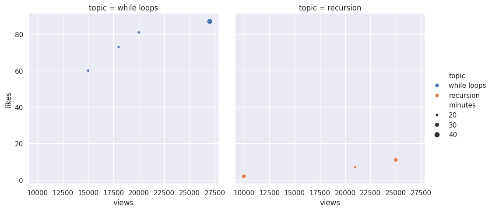
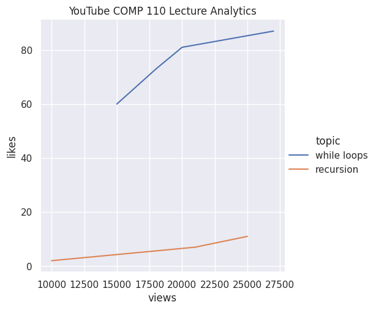

---
# Do not edit the text between these lines!
layout: default
---

# Ex09 Final Exercise in Comp110!

<!-- This is a comment. Below, you'll see code for inserting an image. To make this image appear, update <custom-path>. To add an image, save it inside the imgs folder of this repository. -->

<!--  -->

## Introduction 
My name is David Beggel, this is my first year at university although I am 29 years old. I plan on majoring in Neuroscience and graduate in the summer of 2029. This has been my first ever exposure to coding and any computer science related course. Prior to attending UNC Chapel Hill, I was in the military for over a decade, which is where I met my wife and now have three adorable children. 

### First Method of Improvement

Throughout this course, there were many times I found myself frustruated with my progress in code writing and understanding how it functioned. Through my analysis during this exercise as well as asking other students directly I believe there are some areas that can be improved upon to help students understand these concepts on a deeper level. 
The first area I believe that could be improved upon is having pre-lecture videos, problems to work on prior to class. Since we have lecture only three days per week. It could be helpful to have a video that generalizes what will be taught, as well as five practice questions that we could work on to see if we learned anything from the video. Giving us the ability to ask more in-depth questions during class or office hours. I found myself sometimes lost during the lectures with all the verbiage and fast pace of it. 

### Second Method of Improvement

During the semester we rarely had opportunities to work with other students in a collaborative sense on projects or exercises. The course should implement collaborative work to encourage students to learn in a healthy and enjoyable environment and help build confidence in their code writing abilities. 

### Third Method of Improvement

If there was a livestreamed version of the course, it could help alleviate some stress that students have if theyre unable to make it to the course due to a pleothera of reasons. Trying to interpret what the professor was saying while looking at the slides is a difficult task and this method would enable students to see a video recording of what the professor is going to say. 

### Fourth Method of Improvement

The office hours for this course are at very difficult times for many students. If there were office hours later on in the evening it would allow more students to visit them since a majority of class are between 11:00am and 5:00pm. If they adjusted the hours to be from 1:00pm to 7:00pm it could give more students a chance to sit with a TA or peer instructor about the course matieral without worrying about running out of time or having to rush. 

### Analysis

This course is beneficial for students who are seeking a future in Computer Science, and any career in coding. However it seems that for many students who are not Computer Science majors, it can seem confusing as to why they are being required to take this course. I do beleive that have a basic grasp of what coding is and how it operates is important in this modern age. 